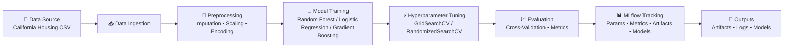

# 🏗️ ML Training Pipeline

[](https://www.python.org/) [](https://scikit-learn.org/stable/) [](https://mlflow.org/) [](https://hydra.cc/)


## An **end-to-end machine learning training pipeline** for the California Housing dataset featuring configurable workflows, experiment tracking, and modular components.

🚀 Features
🔧 Configurable Tasks: Support for both regression (predicting median house value) and classification (price categories)

🧩 Modular Pipeline: Separate components for data ingestion, preprocessing, model training, and evaluation

🤖 Multiple Models: Random Forest, Logistic Regression, Gradient Boosting with hyperparameter tuning

📊 Experiment Tracking: Comprehensive MLflow integration for metrics, parameters, and artifacts

⚡ Automated Preprocessing: Smart handling of missing values, scaling, and encoding based on configuration

📈 Performance Monitoring: Cross-validation with multiple scoring metrics
```
ml-training-pipeline/
├── 📂 configs/                 # Hydra configuration files
│   ├── config.yaml            # Main configuration
│   ├── 📂 dataset/            # Dataset-specific configs
│   ├── 📂 model/              # Model hyperparameters
│   ├── 📂 preprocessing/      # Preprocessing strategies
│   └── 📂 training/           # Training parameters
├── 📂 src/Training_pipeline/  # Core pipeline code
│   ├── 📂 components/         # Data ingestion, transformation, training
│   └── 📂 pipeline/           # Pipeline orchestration
├── 📂 artifacts/              # Processed data & preprocessing objects
├── 📂 models/                 # Saved trained models
├── 📂 mlruns/                 # MLflow experiment tracking
├── 📂 logs/                   # Training logs
└── 📂 tests/                  # Test cases
```

## 🛠️ Workflow Diagram



## 💻 Installation
### Prerequisites
- Python 3.8+  
- pip package manager  
### Step-by-Step Setup
## Clone the repository
git clone <repository-url>
cd ml-training-pipeline

## Create virtual environment
python -m venv .venv
source .venv/bin/activate   # Windows: .venv\Scripts\activate

## Install dependencies
pip install -r requirements.txt

### Prepare the Dataset
- Download the California Housing dataset.  
- Place it at: Data_Set\\housing.csv *(or update path in config)*  
- Optional: use built-in dataset loader in src/utils.py.

## 🏃 Quick Start
### Regression (Default: Random Forest)
python main.py

### Classification (Logistic Regression)
python main.py dataset.task_type=classification model=logistic_regression

### View Results in MLflow
mlflow ui --backend-store-uri mlruns/
Open [http://localhost:5000](http://localhost:5000) in browser.

## ⚙️ Configuration
### Dataset Config
```
dataset:
  name: "california_housing"
  task_type: "regression"  # or "classification"
  target_column: "median_house_value"
  test_size: 0.2
  random_state: 42

### Model Options
- random_forest → Tree-based ensemble  
- logistic_regression → Linear classifier  
- gradient_boosting → Boosted ensemble  

### Preprocessing Config
preprocessing:
  numeric:
    imputer: "median"
    scaler: "standard"   # standard, minmax, robust
  categorical:
    encoder: "onehot"
```

## 📚 Usage Examples
```
# Gradient Boosting for regression

python main.py model.model.type=gradient_boosting
# Custom hyperparameters
python main.py 

# Classification / Regression 
python main.py dataset.task_type=Y model.model.type= X
## Advanced
python main.py preprocessing.numeric.scaler=minmax preprocessing.categorical.encoder=ordinal

python main.py dataset.test_size=0.3 training.cv_folds=3
```

## 📊 Outputs
- artifacts/ → processed datasets, preprocessing objects, metrics  
- models/ → trained models (.pkl)  
- logs/ → detailed training logs  
- mlruns/ → MLflow experiment tracking  

## 🔬 MLflow Tracking

mlflow ui --backend-store-uri mlruns/
mlflow ui --backend-store-uri mlruns/ --experiment-name "housing_prediction"

## 🐛 Troubleshooting
```bash
# Dataset not found
python main.py paths.dataset_path="/new/path/housing.csv"

# Memory issues
python main.py dataset.test_size=0.1 model.random_forest.hyperparameters.max_depth=10

# MLflow errors
rm -rf mlruns/
python main.py

# Debug mode
python main.py logging.level=DEBUG
```
📄 License
This project is licensed under the MIT License.

🙏 Acknowledgments
Name: Manish Kumar
California Housing Dataset: UCI Machine Learning Repository

Hydra: Flexible configuration management

MLflow: Machine learning lifecycle management

Scikit-learn: Machine learning algorithms and utilities

Need Help? Check the troubleshooting section or examine generated log files.

Found a Bug? Please open an issue with configuration used and error details.
